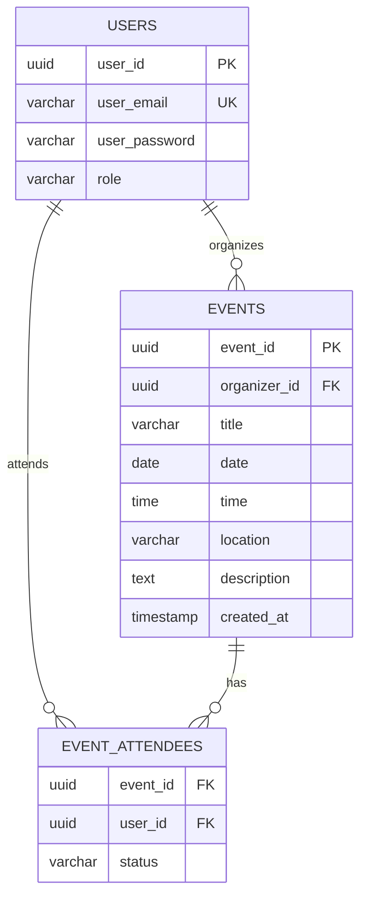

<div align="center">

# 🗓️ EventPlanner — Backend API

**A RESTful API for managing events, invitations, and attendee responses.**


[Features](#-features) · [Quick Start](#-quick-start) · [API Reference](#-api-reference) · [Database Schema](#-database-schema) · [Deployment](#-deployment)

</div>

---

## 📖 Overview

EventPlanner Backend is the server-side component of the **EventPlanner** application — a full-stack platform that enables users to create events, invite attendees, and manage RSVPs in real time. Built with **Node.js**, **Express**, and **PostgreSQL**, this API follows a clean MVC architecture and provides secure, JWT-based authentication.

> 🖥️ **Looking for the frontend?** The React client lives in a [separate repository](https://github.com/).

---

## ✨ Features

| Category | Details |
|---|---|
| **Authentication** | Secure signup & login with bcrypt password hashing and JWT tokens |
| **Role Management** | Users register as either `organizer` or `attendee` |
| **Event CRUD** | Create, view, and delete events with full ownership control |
| **Invitation System** | Organizers invite attendees by email; attendees see their invitations |
| **RSVP Responses** | Attendees respond with `Going`, `Maybe`, or `Not Going` |
| **Attendee Tracking** | Organizers view the full attendee list with RSVP statuses |
| **Advanced Search** | Filter events by keyword, date range, and role |
| **CORS Protection** | Configured allowlist for frontend origins |
| **Docker Support** | Containerized app & database with Docker |

---

## 🛠️ Tech Stack

- **Runtime:** Node.js 18+
- **Framework:** Express.js 4.18
- **Database:** PostgreSQL 15 (via `pg` driver)
- **Authentication:** JSON Web Tokens (`jsonwebtoken`) + `bcryptjs`
- **API Docs:** Swagger (swagger-jsdoc + swagger-ui-express)
- **Containerization:** Docker
- **Dev Tools:** Nodemon, Postman

---

## 🚀 Quick Start

### Prerequisites

- [Node.js](https://nodejs.org/) v18 or higher
- [PostgreSQL](https://www.postgresql.org/) 15+ (or Docker)
- [npm](https://www.npmjs.com/)

### 1 — Clone the Repository

```bash
git clone https://github.com/<your-username>/event-planner-project-backend.git
cd event-planner-project-backend
```

### 2 — Install Dependencies

```bash
npm install
```

### 3 — Configure Environment Variables

Create a `.env` file in the project root (or modify the existing one):

```env
# Database Configuration
DB_HOST=localhost        # Use 'db' if running with Docker
DB_PORT=5432
DB_USER=postgres
DB_PASSWORD=your_password
DB_NAME=eventplanner_db

# JWT Configuration
JWT_SECRET=your_super_secret_key
```

### 4 — Set Up the Database

Run the SQL schema against your PostgreSQL instance:

```bash
psql -U postgres -d eventplanner_db -f db/database.sql
```

### 5 — Start the Server

```bash
# Development (with hot-reload)
npm run dev

# Production
npm start
```

The server starts on **`http://localhost:5000`**.

---

## 🐳 Docker

### Run with Docker

```bash
# Build the API image
docker build -t eventplanner-backend .

# Run the container
docker run -p 5000:5000 --env-file .env eventplanner-backend
```

The `db/` directory includes its own Dockerfile to spin up a PostgreSQL instance with the schema pre-loaded:

```bash
# Build the database image
docker build -t eventplanner-db ./db

# Run PostgreSQL
docker run -d -p 5432:5432 -e POSTGRES_PASSWORD=0000 -e POSTGRES_DB=eventplanner_db eventplanner-db
```

> **Tip:** Set `DB_HOST=db` in your `.env` when using Docker Compose or container networking.

---

## 📡 API Reference

**Base URL:** `http://localhost:5000`

All protected routes require an `Authorization` header:
```
Authorization: Bearer <jwt_token>
```

### 🔐 Authentication

| Method | Endpoint | Description | Auth |
|--------|----------|-------------|------|
| `POST` | `/auth/signup` | Register a new user | ✗ |
| `POST` | `/auth/login` | Authenticate & receive token | ✗ |

<details>
<summary><b>POST /auth/signup</b> — Register a new user</summary>

**Request Body:**
```json
{
  "email": "user@example.com",
  "password": "securepassword",
  "role": "organizer"           // optional, defaults to "attendee"
}
```

**Response `201`:**
```json
{
  "message": "User created successfully",
  "token": "eyJhbGciOiJIUzI1NiIs...",
  "user": {
    "user_id": "uuid",
    "user_email": "user@example.com",
    "role": "organizer"
  }
}
```
</details>

<details>
<summary><b>POST /auth/login</b> — Authenticate user</summary>

**Request Body:**
```json
{
  "email": "user@example.com",
  "password": "securepassword"
}
```

**Response `200`:**
```json
{
  "message": "Login successful",
  "token": "eyJhbGciOiJIUzI1NiIs...",
  "user": {
    "user_id": "uuid",
    "user_email": "user@example.com",
    "role": "organizer"
  }
}
```
</details>

---

### 📅 Event Management

| Method | Endpoint | Description | Auth |
|--------|----------|-------------|------|
| `POST` | `/events` | Create a new event | ✔ |
| `GET` | `/events/organized` | Get events created by the user | ✔ |
| `GET` | `/events/invited` | Get events user is invited to | ✔ |
| `DELETE` | `/events/:id` | Delete an event (organizer only) | ✔ |

<details>
<summary><b>POST /events</b> — Create a new event</summary>

**Request Body:**
```json
{
  "title": "Tech Conference 2026",
  "date": "2026-11-10",
  "time": "09:00",
  "location": "Convention Center",
  "description": "Annual tech meetup"
}
```

**Response `201`:**
```json
{
  "event_id": "uuid",
  "organizer_id": "uuid",
  "title": "Tech Conference 2026",
  "date": "2026-11-10",
  "time": "09:00:00",
  "location": "Convention Center",
  "description": "Annual tech meetup",
  "created_at": "2026-05-19T12:00:00.000Z"
}
```
</details>

---

### 💌 Invitations & Responses

| Method | Endpoint | Description | Auth |
|--------|----------|-------------|------|
| `POST` | `/events/:event_id/invite` | Invite a user by email | ✔ |
| `POST` | `/events/:id/respond` | RSVP to an event | ✔ |
| `GET` | `/events/:id/attendees` | View attendees list (organizer only) | ✔ |

<details>
<summary><b>POST /events/:event_id/invite</b> — Invite a user</summary>

**Request Body:**
```json
{
  "email": "attendee@example.com"
}
```

**Response `200`:**
```json
{
  "message": "Invitation sent successfully"
}
```
</details>

<details>
<summary><b>POST /events/:id/respond</b> — RSVP to an event</summary>

**Request Body:**
```json
{
  "status": "Going"    // "Going" | "Maybe" | "Not Going"
}
```

**Response `200`:**
```json
{
  "message": "Response recorded",
  "status": "Going"
}
```
</details>

---

### 🔍 Search

| Method | Endpoint | Description | Auth |
|--------|----------|-------------|------|
| `GET` | `/events/search` | Search events with filters | ✔ |

**Query Parameters:**
| Parameter | Type | Description |
|-----------|------|-------------|
| `keyword` | string | Partial match on title or description |
| `startDate` | date | Filter events from this date (YYYY-MM-DD) |
| `endDate` | date | Filter events up to this date (YYYY-MM-DD) |
| `role` | string | Filter by `organizer` or `attendee` perspective |

**Example:**
```
GET /events/search?keyword=Tech&startDate=2026-01-01&endDate=2026-12-31&role=organizer
```

---

## 🗄️ Database Schema

The application uses **PostgreSQL** with UUID primary keys via the `uuid-ossp` extension.



### Tables

| Table | Purpose |
|-------|---------|
| `users` | Stores user accounts with hashed passwords and roles (`organizer` / `attendee`) |
| `events` | Stores event details linked to an organizer |
| `event_attendees` | Junction table mapping users to events with RSVP status |

---

## 📁 Project Structure

```
event-planner-project-backend/
├── controllers/
│   ├── auth.js            # Signup & login logic
│   └── events.js          # Event CRUD, invitations, search
├── db/
│   ├── database.sql       # Schema definition
│   ├── index.js           # PostgreSQL connection pool
│   └── Dockerfile         # Database container
├── middleware/
│   └── authorize.js       # JWT verification middleware
├── routes/
│   ├── auth.js            # Auth route definitions
│   └── events.js          # Event route definitions
├── .env                   # Environment variables
├── Dockerfile             # API container
├── package.json
├── server.js              # Application entry point
└── README.md
```

---

## 🔒 Security

| Concern | Implementation |
|---------|---------------|
| **Password Storage** | Hashed with bcrypt (10 salt rounds) |
| **Authentication** | JWT tokens with 7-day expiry |
| **Authorization** | Middleware validates tokens on every protected route |
| **CORS** | Strict origin allowlist for frontend domains |
| **SQL Injection** | Parameterized queries throughout |
| **Ownership Control** | Only event organizers can delete events or invite users |

---

## 🧪 Testing with Postman

A Postman collection is included in the repository for rapid API testing:

1. Import `final postman collection.json` into Postman
2. Create an environment variable called `token`
3. Run the **Login** request — the token is automatically saved
4. Execute any protected endpoint

> The collection covers all endpoints across Authentication, Event Management, Invitations & Responses, and Search.

---

## 🌐 Deployment

This backend is deployment-ready for **Red Hat OpenShift** and any Docker-compatible platform:

| Platform | Status |
|----------|--------|
| **OpenShift** | Production deployment configured with CORS allowlist |
| **Docker** | Full Dockerfile for both API and database |
| **Heroku / Railway** | Compatible — set `DB_HOST` to your cloud PostgreSQL host |

---

## 📄 License

This project is licensed under the **ISC License**.

---

<div align="center">

**Built with ❤️ using Node.js, Express & PostgreSQL**

</div>
